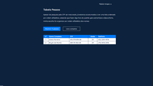
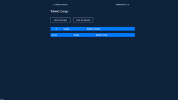
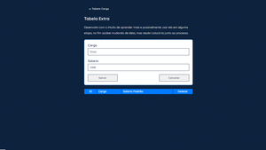

<h1 align="center">Resposta ao formulário</h1>
<p align="center">Esta é o documento de resposta ao formulario!</p>


### Informações Gerais

```bash
# Fiz os exercícios da primeira e da segunda página do formulário. 
# A primeira desenvolvi com a linguagem do Python, que é a que tenho mais familiaridade.
# A segunda desenvolvi com HTML, CSS e JavaScript.
# Não consegui disponibilizar um link para acessar diretamente as tabelas, mas estou deixando alguns GIFs de ilustração.
```


<div align='center'>
</br>
<p align="center">Tabela de Pessoas</p>
    
    <p align="center">Tabela de Cargos</p>
    
    <p align="center">Tabela Extra</p>
    
<div>

<p align="center">Obrigada pelo tempo! :)</p>
